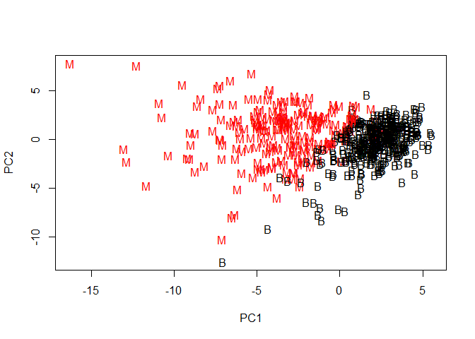
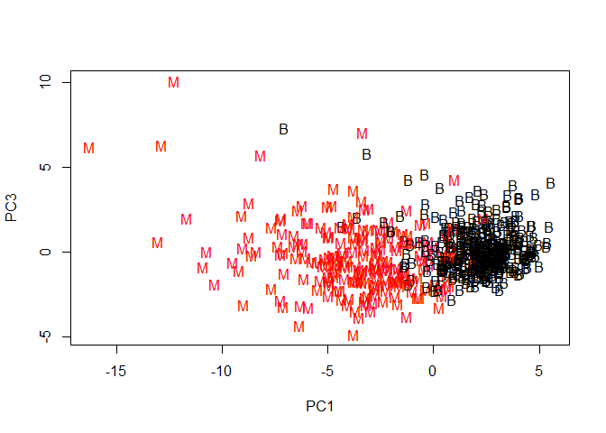
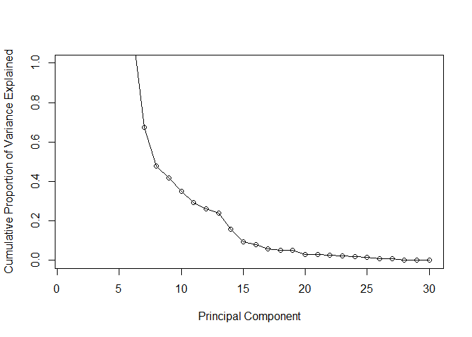

##Preparing the Data 
We will be importing data into R

```r
url <- "https://bioboot.github.io/bimm143_W18/class-material/WisconsinCancer.csv"
wisc.df <- read.csv(url)
```

Now, we have to convert this into a matrix

```r
wisc.data  <- as.matrix(wisc.df[, 3:ncol(wisc.df)])
rownames(wisc.data) <- wisc.df$id
```

Checking up diagnostics

```r
diagnostics <- as.numeric(wisc.df$diagnosis == "M")
```


##Exploring Data Analysis 
Q1. How many observations are in this dataset?

```r
nrow(wisc.data)
```

```
## [1] 569
```

Q2. How many variables/features in the data are suffixed with _mean?

```r
no_of_variables <- max(grep("mean", colnames(wisc.data)))
paste("The number of variables with the suffixed mean is", no_of_variables, sept = " ")
```

```
## [1] "The number of variables with the suffixed mean is 10  "
```


Q3. How many of the observations have a malignant diagnosis?

```r
malignant <- sum(diagnostics)
paste("The number of observations of those that have a malignant diagnosis is",
      malignant, sep = " ")
```

```
## [1] "The number of observations of those that have a malignant diagnosis is 212"
```

##Performing PCA
We will be checking the column means and standard deviations

```r
colMeans(wisc.data)
```

```
##             radius_mean            texture_mean          perimeter_mean 
##            1.412729e+01            1.928965e+01            9.196903e+01 
##               area_mean         smoothness_mean        compactness_mean 
##            6.548891e+02            9.636028e-02            1.043410e-01 
##          concavity_mean     concave.points_mean           symmetry_mean 
##            8.879932e-02            4.891915e-02            1.811619e-01 
##  fractal_dimension_mean               radius_se              texture_se 
##            6.279761e-02            4.051721e-01            1.216853e+00 
##            perimeter_se                 area_se           smoothness_se 
##            2.866059e+00            4.033708e+01            7.040979e-03 
##          compactness_se            concavity_se       concave.points_se 
##            2.547814e-02            3.189372e-02            1.179614e-02 
##             symmetry_se    fractal_dimension_se            radius_worst 
##            2.054230e-02            3.794904e-03            1.626919e+01 
##           texture_worst         perimeter_worst              area_worst 
##            2.567722e+01            1.072612e+02            8.805831e+02 
##        smoothness_worst       compactness_worst         concavity_worst 
##            1.323686e-01            2.542650e-01            2.721885e-01 
##    concave.points_worst          symmetry_worst fractal_dimension_worst 
##            1.146062e-01            2.900756e-01            8.394582e-02 
##                       X 
##                      NA
```

```r
apply(wisc.data, 2, sd)
```

```
##             radius_mean            texture_mean          perimeter_mean 
##            3.524049e+00            4.301036e+00            2.429898e+01 
##               area_mean         smoothness_mean        compactness_mean 
##            3.519141e+02            1.406413e-02            5.281276e-02 
##          concavity_mean     concave.points_mean           symmetry_mean 
##            7.971981e-02            3.880284e-02            2.741428e-02 
##  fractal_dimension_mean               radius_se              texture_se 
##            7.060363e-03            2.773127e-01            5.516484e-01 
##            perimeter_se                 area_se           smoothness_se 
##            2.021855e+00            4.549101e+01            3.002518e-03 
##          compactness_se            concavity_se       concave.points_se 
##            1.790818e-02            3.018606e-02            6.170285e-03 
##             symmetry_se    fractal_dimension_se            radius_worst 
##            8.266372e-03            2.646071e-03            4.833242e+00 
##           texture_worst         perimeter_worst              area_worst 
##            6.146258e+00            3.360254e+01            5.693570e+02 
##        smoothness_worst       compactness_worst         concavity_worst 
##            2.283243e-02            1.573365e-01            2.086243e-01 
##    concave.points_worst          symmetry_worst fractal_dimension_worst 
##            6.573234e-02            6.186747e-02            1.806127e-02 
##                       X 
##                      NA
```
As you can tell, this is not pretty looking

Hence, we are trying this prcomp function. 
Note that we have to omit the last column due to nonnumeric values.

```r
wisc.pr <- prcomp(wisc.data[,1:30], scale. = TRUE)
```

Checking the summary of wisc.pr

```r
summary(wisc.pr)
```

```
## Importance of components:
##                           PC1    PC2     PC3     PC4     PC5     PC6
## Standard deviation     3.6444 2.3857 1.67867 1.40735 1.28403 1.09880
## Proportion of Variance 0.4427 0.1897 0.09393 0.06602 0.05496 0.04025
## Cumulative Proportion  0.4427 0.6324 0.72636 0.79239 0.84734 0.88759
##                            PC7     PC8    PC9    PC10   PC11    PC12
## Standard deviation     0.82172 0.69037 0.6457 0.59219 0.5421 0.51104
## Proportion of Variance 0.02251 0.01589 0.0139 0.01169 0.0098 0.00871
## Cumulative Proportion  0.91010 0.92598 0.9399 0.95157 0.9614 0.97007
##                           PC13    PC14    PC15    PC16    PC17    PC18
## Standard deviation     0.49128 0.39624 0.30681 0.28260 0.24372 0.22939
## Proportion of Variance 0.00805 0.00523 0.00314 0.00266 0.00198 0.00175
## Cumulative Proportion  0.97812 0.98335 0.98649 0.98915 0.99113 0.99288
##                           PC19    PC20   PC21    PC22    PC23   PC24
## Standard deviation     0.22244 0.17652 0.1731 0.16565 0.15602 0.1344
## Proportion of Variance 0.00165 0.00104 0.0010 0.00091 0.00081 0.0006
## Cumulative Proportion  0.99453 0.99557 0.9966 0.99749 0.99830 0.9989
##                           PC25    PC26    PC27    PC28    PC29    PC30
## Standard deviation     0.12442 0.09043 0.08307 0.03987 0.02736 0.01153
## Proportion of Variance 0.00052 0.00027 0.00023 0.00005 0.00002 0.00000
## Cumulative Proportion  0.99942 0.99969 0.99992 0.99997 1.00000 1.00000
```

Q4. From your results, what proportion of the original variance is captured by the first principal components (PC1)?
The answer is 0.4427

Q5. How many principal components (PCs) are required to describe at least 70% of the original variance in the data?
We need just three componenets tha describe at least 70%.

Q6. How many principal components (PCs) are required to describe at least 90% of the original variance in the data?
We need seven component that describe at least 90%. 

##Interpreting PCA Results
We will use the biplot function

```r
biplot(wisc.pr)
```

<!-- -->

Using the scatter plot, add 1 to diagnostics since the value of zero will be white

```r
plot(wisc.pr$x[,1], wisc.pr$x[,2], col = (diagnostics + 1), 
     pch = as.vector(wisc.df$diagnosis), xlab = "PC1", ylab = "PC2")
```

<!-- -->

Repeat for components 1 and 3

```r
plot(wisc.pr$x[, c(1, 3)], col = (diagnostics + 1), pch = as.vector(wisc.df$diagnosis),
     xlab = "PC1", ylab = "PC3")
```

<!-- -->
We see that this plot is more scattered than the previous one. 

Alternative scree plot of the same data, note data driven y-axis

```r
pr.var <- (wisc.pr$sdev)^2 #this will be used later

pve <- pr.var/sum(pr.var)
barplot(pve, ylab = "Precent of Variance Explained",
     names.arg=paste0("PC",1:length(pve)), las=2, axes = FALSE)
axis(2, at=pve, labels=round(pve,2)*100 )
```

<!-- -->

Plot cumulative proportion of variance explained

```r
plot(pr.var, xlab = "Principal Component", 
     ylab = "Cumulative Proportion of Variance Explained", 
     ylim = c(0, 1), type = "o")
```

<!-- -->

##Selecting number of clusters
We need to scale the data and finds the clusters

```r
data.scaled <- scale(wisc.data[,-31])

data.dist <- dist(data.scaled)

wisc.hclust <- hclust(data.dist)
```

Working to make this 

```r
wisc.hclust.clusters <- cutree(wisc.hclust, 4)
table(wisc.hclust.clusters, diagnostics)
```

```
##                     diagnostics
## wisc.hclust.clusters   0   1
##                    1  12 165
##                    2   2   5
##                    3 343  40
##                    4   0   2
```

##K-means clustering and comparing results
Form the k-means claster 

```r
wisc.km <- kmeans(scale(wisc.data[,-31]), centers = 2, nstart = 20)
```

Next, we need to create a table

```r
table(wisc.km$cluster, diagnostics)
```

```
##    diagnostics
##       0   1
##   1  14 175
##   2 343  37
```

We also want to compare k-means clustering and hclust

```r
table(wisc.hclust.clusters, wisc.km$cluster)
```

```
##                     
## wisc.hclust.clusters   1   2
##                    1 160  17
##                    2   7   0
##                    3  20 363
##                    4   2   0
```

##Clustering on PCA results
Use the distance along the first 7 PCs for clustering i.e. wisc.pr$x[, 1:7]

```r
#finding the distance
wisc.pr.dist <- dist(wisc.pr$x[, 1:7])

#using the hclust function
wisc.pr.hclust <- hclust(wisc.pr.dist, method = "complete")
```

Comparing it now using k-means clust

```r
wisc.pr.hclust.clusters <- cutree(wisc.pr.hclust, k=4)
```

Now, let's look at the results

```r
table(wisc.pr.hclust.clusters, diagnostics)
```

```
##                        diagnostics
## wisc.pr.hclust.clusters   0   1
##                       1   5 113
##                       2 350  97
##                       3   2   0
##                       4   0   2
```


