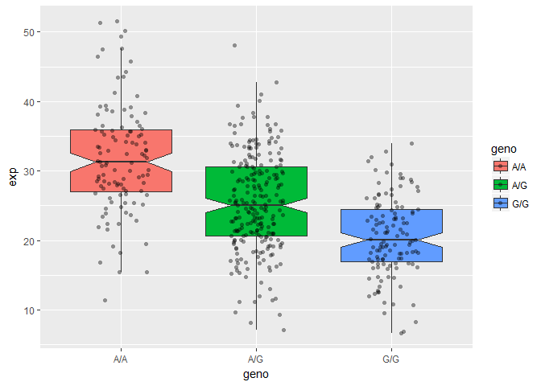

##1000 Genomes Data Analysis

Downloaded CSV file for MXL 

```r
#Read CSV 
MXL <- read.csv("373531-SampleGenotypes-Homo_sapiens_Variation_Sample_rs8067378.csv", header = TRUE)
```

Finding the percentage

```r
MXL.summary <- table(MXL[,2])
MXL.summary/nrow(MXL)*100
```

```
## 
##     A|A     A|G     G|A     G|G 
## 34.3750 32.8125 18.7500 14.0625
```

The answer is 14% (of G|G)

###Side-note: Fasta quality scores 

```r
library(seqinr)
```

```
## Warning: package 'seqinr' was built under R version 3.4.4
```

```r
library(gtools)
phred <- asc(s2c("DDDDCDEDCDDDDBBDDDCC@")) - 33 
phred
```

```
##  D  D  D  D  C  D  E  D  C  D  D  D  D  B  B  D  D  D  C  C  @ 
## 35 35 35 35 34 35 36 35 34 35 35 35 35 33 33 35 35 35 34 34 31
```


```r
prob <- 10**(-phred/10)
prob
```

```
##            D            D            D            D            C 
## 0.0003162278 0.0003162278 0.0003162278 0.0003162278 0.0003981072 
##            D            E            D            C            D 
## 0.0003162278 0.0002511886 0.0003162278 0.0003981072 0.0003162278 
##            D            D            D            B            B 
## 0.0003162278 0.0003162278 0.0003162278 0.0005011872 0.0005011872 
##            D            D            D            C            C 
## 0.0003162278 0.0003162278 0.0003162278 0.0003981072 0.0003981072 
##            @ 
## 0.0007943282
```


##Population Scale Analysis 

Read this file 

```r
txt <- read.table("rs8067378_ENSG00000172057.6.txt")
summary(txt)
```

```
##      sample     geno          exp        
##  HG00096:  1   A/A:108   Min.   : 6.675  
##  HG00097:  1   A/G:233   1st Qu.:20.004  
##  HG00099:  1   G/G:121   Median :25.116  
##  HG00100:  1             Mean   :25.640  
##  HG00101:  1             3rd Qu.:30.779  
##  HG00102:  1             Max.   :51.518  
##  (Other):456
```

Looking at the data, also seeing the amount of patients

```r
table(txt$geno)
```

```
## 
## A/A A/G G/G 
## 108 233 121
```

```r
paste("The number of patients is", nrow(txt))
```

```
## [1] "The number of patients is 462"
```

Set numeric values

```r
boxplot(exp ~ geno, data = txt, notch = TRUE)
```

<!-- -->
You can see that there's no overlap, so these SNPs are significant 

Install ggplot

```r
library(ggplot2)
```

```
## Warning: package 'ggplot2' was built under R version 3.4.4
```


```r
ggplot(txt, aes(geno, exp)) + geom_boxplot()
```

<!-- -->

Boxplot with the data shown

```r
ggplot(txt, aes(geno, exp, fill=geno)) + 
  geom_boxplot(notch=TRUE, outlier.shape = NA) + 
  geom_jitter(shape=16, position=position_jitter(0.2), alpha=0.4)
```

<!-- -->
