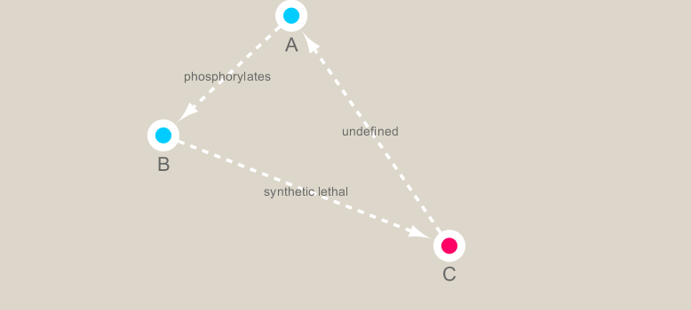

```{r setup, include=FALSE}
knitr::opts_chunk$set(echo = TRUE)
```


##Setting up Cytoscape and igraph
Installing packages
```{r}
library(RCy3)
library(igraph)
library(RColorBrewer)
```

Trying out the Demo
```{r}
cwd <- demoSimpleGraph()
```

```{r}
layoutNetwork(cwd, 'force-directed')

# choose any of the other possible layouts e.g.:
possible.layout.names <- getLayoutNames(cwd)
layoutNetwork (cwd, possible.layout.names[1])

# Test the connection to Cytoscape.
ping(cwd)
```

Switching Visual Styles
```{r}
setVisualStyle(cwd, "Marquee")
```

We can also save our image
```{r}
saveImage(cwd, 
          file.name = "demo",
          image.type = "png",
          h = 350)
```

```{r}
library(knitr)

```

We can basically just set up these styles differently according to our needs

##Reading out metagenomics data
Obtaining our data
```{r}
## scripts for processing located in "inst/data-raw/"
prok_vir_cor <- read.delim("data/virus_prok_cor_abundant.tsv", stringsAsFactors = FALSE)

## Have a peak at the first 6 rows
head(prok_vir_cor)
```

Creating a new data frame
```{r}
g <- graph.data.frame(prok_vir_cor, directed = FALSE)
class(g)
g
```

Let's look at the plot
```{r}
plot(g)
```

That's not appealing, let's look at another one.
```{r}
plot(g, vertex.size=3, vertex.label=NA)
```

Wd don't see what is catergorized, but we do have the network
Now we can classify, and set, V and E
```{r}
V(g)
```

```{r}
E(g)
```

##Read in Taxomonic Classification
```{r}
phage_id_affiliation <- read.delim("./data/phage_ids_with_affiliation.tsv")
head(phage_id_affiliation)
```

```{r}
bac_id_affi <- read.delim("./data/prok_tax_from_silva.tsv")
head(bac_id_affi)
```

##Adding Taxmonic Classifications
Time to create a gene network
```{r}
genenet.nodes <- as.data.frame(vertex.attributes(g))
```

We have to create some empty spaces, since not all have classifications
```{r}
genenet.nodes$phage_aff <- rep("not_class", nrow(genenet.nodes))
genenet.nodes$Tax_order <- rep("not_class", nrow(genenet.nodes))
genenet.nodes$Tax_subfamily <- rep("not_class", nrow(genenet.nodes))

for (row in seq_along(1:nrow(genenet.nodes))){
  if (genenet.nodes$name[row] %in% phage_id_affiliation$first_sheet.Phage_id_network){
    id_name <- as.character(genenet.nodes$name[row])
    aff_to_add <- unique(subset(phage_id_affiliation,
                                first_sheet.Phage_id_network == id_name,
                                select = c(phage_affiliation,
                                           Tax_order,
                                           Tax_subfamily)))
    genenet.nodes$phage_aff[row] <- as.character(aff_to_add$phage_affiliation)
    genenet.nodes$Tax_order[row] <- as.character(aff_to_add$Tax_order)
    genenet.nodes$Tax_subfamily[row] <- as.character(aff_to_add$Tax_subfamily)
  }
}
```

Note the one above was for phages, time to do the same with viruses
```{r}
genenet.nodes$prok_king <- rep("not_class", nrow(genenet.nodes))
genenet.nodes$prok_tax_phylum <- rep("not_class", nrow(genenet.nodes))
genenet.nodes$prok_tax_class <- rep("not_class", nrow(genenet.nodes))

for (row in seq_along(1:nrow(genenet.nodes))){
  if (genenet.nodes$name[row] %in% bac_id_affi$Accession_ID){
    aff_to_add <- unique(subset(bac_id_affi,
                                Accession_ID == as.character(genenet.nodes$name[row]),
                                select = c(Kingdom,
                                           Phylum,
                                           Class)))
    
    genenet.nodes$prok_king[row] <- as.character(aff_to_add$Kingdom)
    genenet.nodes$prok_tax_phylum[row] <- as.character(aff_to_add$Phylum)
    genenet.nodes$prok_tax_class[row] <- as.character(aff_to_add$Class)
  }
}
```

Sending this to cytoplot
```{r}
genenet.edges <- data.frame(igraph::as_edgelist(g))
names(genenet.edges) <- c("name.1", "name.2")

genenet.edges$Weight <- igraph::edge_attr(g)[[1]]

genenet.edges$name.1 <- as.character(genenet.edges$name.1)
genenet.edges$name.2 <- as.character(genenet.edges$name.2)
genenet.nodes$name <- as.character(genenet.nodes$name)

ug <- cyPlot(genenet.nodes,genenet.edges)
```

Remove all memory from Cytoscape
```{r}
cy <- CytoscapeConnection()
deleteAllWindows(cy)
```

Sweet! Now let's display some new networks/graphs
```{r}
cw <- CytoscapeWindow("Tara oceans",
                      graph = ug,
                      overwriteWindow = TRUE)
```


```{r}
displayGraph(cw)
layoutNetwork(cw)
fitContent(cw)
```

Yikes, we need to make this look nicer. 

##Color network by prokaryotic phylum
We will be using ColorBrewer for some nice add ons
```{r}
families_to_colour <- unique(genenet.nodes$prok_tax_phylum)
families_to_colour <- families_to_colour[!families_to_colour %in% "not_class"]
node.colour <- RColorBrewer::brewer.pal(length(families_to_colour), "Set3")
```

```{r}
setNodeColorRule(cw,
                 "prok_tax_phylum",
                 families_to_colour,
                 node.colour,
                 "lookup",
                 default.color = "#ffffff")
```


```{r}
displayGraph(cw)
layoutNetwork(cw)
fitContent(cw)
```

Setting node shape to either phage or virus
```{r}
shapes_for_nodes <- c("DIAMOND")

phage_names <- grep("ph_",
                    genenet.nodes$name,
                    value = TRUE)
setNodeShapeRule(cw,
                 "label",
                 phage_names,
                 shapes_for_nodes)
```

```{r}
displayGraph(cw)
fitContent(cw)
```

Coloring the phage nodes
```{r}
setDefaultNodeBorderWidth(cw, 5)
families_to_colour <- c(" Podoviridae",
                        " Siphoviridae",
                        " Myoviridae")
node.colour <- RColorBrewer::brewer.pal(length(families_to_colour),
                          "Dark2")
setNodeBorderColorRule(cw,
                       "Tax_subfamily",
                       families_to_colour,
                       node.colour,
                       "lookup", 
                       default.color = "#000000")
```

```{r}
displayGraph(cw)
fitContent(cw)
```

##Minimizing the amount of overlap
More classification
```{r}
getLayoutNames(cw)
```

```{r}
getLayoutPropertyNames(cw, layout.name="force-directed")
```

```{r}
getLayoutPropertyValue(cw, "force-directed", "defaultSpringLength")
```

```{r}
getLayoutPropertyValue(cw, "force-directed", "numIterations")  
```

```{r}
layoutNetwork(cw, layout.name = "force-directed")
fitContent(cw)
```

##Examining Network Properties
```{r}
## initiate a new node attribute
ug2 <- initNodeAttribute(graph = ug,
                          "degree",
                          "numeric",
                          0.0) 

## degree from graph package for undirected graphs not working well,
## so instead using igraph to calculate this from the original graph
nodeData(ug2, nodes(ug2), "degree") <- igraph::degree(g)

cw2 <- CytoscapeWindow("Tara oceans with degree",
                      graph = ug2,
                      overwriteWindow = TRUE)
```

```{r}
displayGraph(cw2)
layoutNetwork(cw2)
```

By size degrees
```{r}
degree_control_points <- c(min(igraph::degree(g)),
                           mean(igraph::degree(g)),
                           max(igraph::degree(g)))
node_sizes <- c(20,
                20,
                80,
                100,
                110) # number of control points in interpolation mode,
                     # the first and the last are for sizes "below" and "above" the attribute seen.

setNodeSizeRule(cw2,
                "degree",
                degree_control_points,
                node_sizes,
                mode = "interpolate")
```

```{r}
layoutNetwork(cw2,
              "force-directed")
```

##Select an interesting node and make a subnetwork from it

